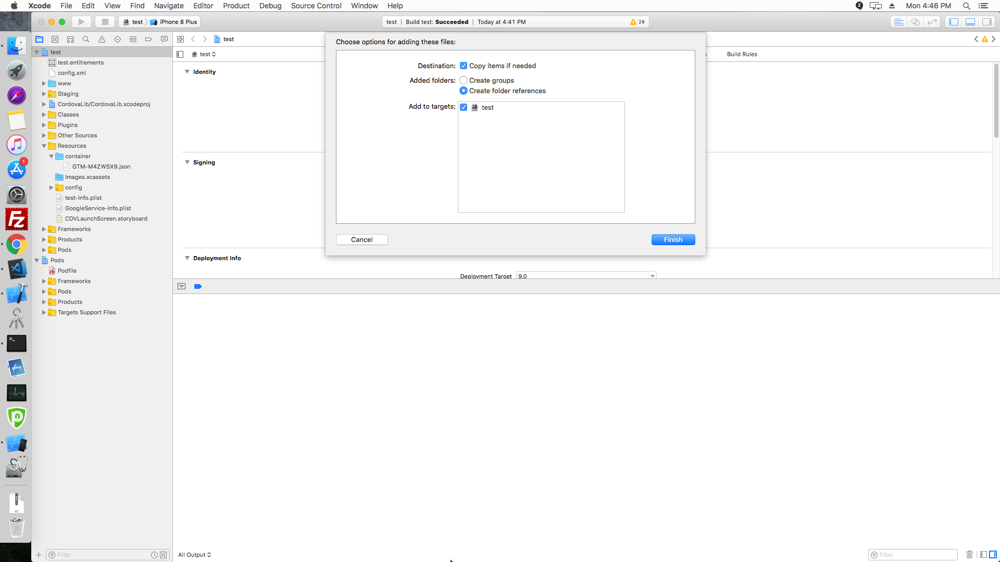
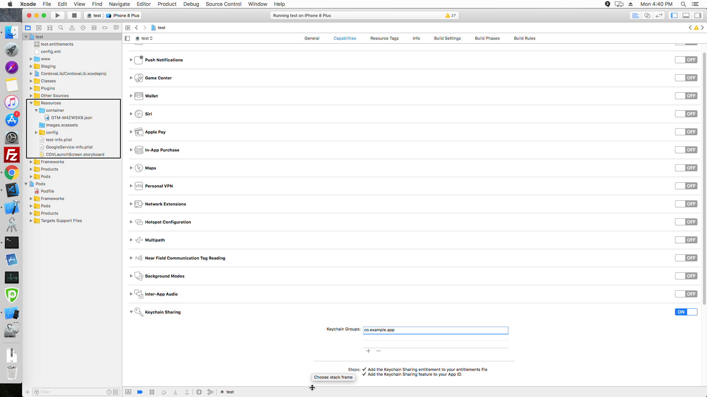

# Cordova/Ionic Firebase Enhanced Ecommerce Analytics Plugins.

Cordova/Ionic plugin for firebase enhanced ecommerce analytics.

## INSTALLATION

`cordova plugin add -d https://github.com/JABJustaBaby/cordova-plugins-firebaseecommerceanalytics --variable "FIREBASE_CORE_VERSION" = "16.+"`

If you are having some issues with pod in ios, please do this and reinstall the plugin

```
  cd platforms/ios
  pod setup
  pod update --repo-update
```

## PLATFORMS

- Android
- iOS (Work in progress)

## README

Please make sure Firebase and Play services version matches with your other plugins in the project. Also in iOS please open .xcworkspace file in Xcode * rather than .xcodeproj file or You can also directly open folder platforms/ios in Xcode if you do not want to select file. If you do not do so, then Xcode *will not be able to load all the pod dependencies.

- Please put google-services.json and GoogleService-Info.plist file in your project root or inside www folder
- Please add following in your config.xml, before installing the plugin

  ```
  <preference name="GTMAndroidContainerName" value="GTM-XXXXXXX.json" />
  <preference name="GTMiOSContainerName" value="GTM-XXXXXXX.json" />
  ```

  Container file should be in the format GTM-XXXXXX.json and should be present inside www folder

- For iOS

  1. Please add container folder present in platfomrs/ios/containers/ like as shown here to Resources.
     

  2. You can add the GoogleService-Info.plist (platform/ios/projectname/Resources/) file too like the above method, make sure to select Create Groups.

  3. This is how it should look -

  

## Methods

---

### logProductsListing(products)

Measure product impressions by logging event with an ITEM_LIST parameter and one or more items (i.e. products) defined with the relevant fields.

**Parameters**

**products**: `Array.&lt;object&gt;`, Array of product items.

**item_name**: `String`, Item Lists Name to send to Firebase. Defaults to "Search Results"

**Example**:

```js
var products = [
  {
    ITEM_ID: 'sku1234',
    ITEM_NAME: 'Donut Friday Scented T-Shirt',
    ITEM_CATEGORY: 'Apparel/Men/Shirts',
    ITEM_VARIANT: 'Blue',
    ITEM_BRAND: 'Google',
    PRICE: 29.99,
    CURRENCY: 'USD',
    INDEX: 1, //incremented value, next product should have index 2
  },
];

var item_name = 'Search Results';

cordova.plugins.FirebaseEcommerceAnalytics.logProductsListing(
  products,
  item_name,
  successCallback,
  errorCallback
);
```

### logSelectProduct(product)

This function is used to log product click/select impressions..

**Parameters**

**product**: `Object`, Single product object

**item_name**: `String`, Item Lists Name to send to Firebase. Defaults to "Search Results"

**Example**:

```js
var product = {
  ITEM_ID: 'sku1234',
  ITEM_NAME: 'Donut Friday Scented T-Shirt',
  ITEM_CATEGORY: 'Apparel/Men/Shirts',
  ITEM_VARIANT: 'Blue',
  ITEM_BRAND: 'Google',
  PRICE: 29.99,
  CURRENCY: 'USD',
  INDEX: 1, //incremented value, next product should have index 2
};

var item_name = 'Search Results';

cordova.plugins.FirebaseEcommerceAnalytics.logSelectProduct(
  product,
  item_name,
  successCallback,
  errorCallback
);
```

### logProductDetailView(product)

Measure product clicks by logging a SELECT_CONTENT event with an item (i.e. product) defined with the relevant fields

**Parameters**

**product**: `Object`, Single product object

**Example**:

```js
var product = {
  ITEM_ID: 'sku1234',
  ITEM_NAME: 'Donut Friday Scented T-Shirt',
  ITEM_CATEGORY: 'Apparel/Men/Shirts',
  ITEM_VARIANT: 'Blue',
  ITEM_BRAND: 'Google',
  PRICE: 29.99,
  CURRENCY: 'USD',
  INDEX: 1, //incremented value, next product should have index 2
};

cordova.plugins.FirebaseEcommerceAnalytics.logProductDetailView(
  product,
  successCallback,
  errorCallback
);
```

### logAddToCart(product)

Measure a product being added to a shopping cart by logging an ADD_TO_CART event with an item (i.e. product) defined with the relevant fields

**Parameters**

**product**: `Object`, Single product object

**Example**:

```js
var product = {
  ITEM_ID: 'sku1234',
  ITEM_NAME: 'Donut Friday Scented T-Shirt',
  ITEM_CATEGORY: 'Apparel/Men/Shirts',
  ITEM_VARIANT: 'Blue',
  ITEM_BRAND: 'Google',
  PRICE: 29.99,
  CURRENCY: 'USD',
  QUANTITY: 1,
};

cordova.plugins.FirebaseEcommerceAnalytics.logAddToCart(product, successCallback, errorCallback);
```

### logRemoveFromCart(product)

Measure a product being removed from a shopping cart by logging a REMOVE_FROM_CART event with an item (i.e. product) defined with the relevant fields

**Parameters**

**product**: `Object`, Single product object

**Example**:

```js
var product = {
  ITEM_ID: 'sku1234',
  ITEM_NAME: 'Donut Friday Scented T-Shirt',
  ITEM_CATEGORY: 'Apparel/Men/Shirts',
  ITEM_VARIANT: 'Blue',
  ITEM_BRAND: 'Google',
  PRICE: 29.99,
  CURRENCY: 'USD',
  QUANTITY: 1,
};

cordova.plugins.FirebaseEcommerceAnalytics.logRemoveFromCart(
  product,
  successCallback,
  errorCallback
);
```

### logPromotionView(promotion)

Measure promotion impressions by logging a VIEW_ITEM, VIEW_ITEM_LIST, or VIEW_SEARCH_RESULTS event with a promotion item defined with the relevant fields

**Parameters**

**promotion**: `Object`, Single promotion data

**Example**:

```js
var promotion = {
  ITEM_ID: 'PROMO_1234',
  ITEM_NAME: 'Summer Sale',
  CREATIVE_NAME: 'summer_banner2',
  CREATIVE_SLOT: 'banner_slot1',
};

cordova.plugins.FirebaseEcommerceAnalytics.logPromotionView(
  promotion,
  successCallback,
  errorCallback
);
```

### logSelectPromotion(promotion)

Measure promotion clicks by logging a SELECT_CONTENT event with a promotion defined with the relevant fields

**Parameters**

**promotion**: `Object`, Single promotion data

**Example**:

```js
var promotion = {
  ITEM_ID: 'PROMO_1234',
  ITEM_NAME: 'Summer Sale',
  CREATIVE_NAME: 'summer_banner2',
  CREATIVE_SLOT: 'banner_slot1',
};

cordova.plugins.FirebaseEcommerceAnalytics.logSelectPromotion(
  promotion,
  successCallback,
  errorCallback
);
```

### logBeginCheckout(products)

Measure the first step in a checkout process by logging a BEGIN_CHECKOUT event with one or more items (i.e. products) defined with the relevant fields

**Parameters**

**products**: `Array.&lt;object&gt;`, Array of product items.

**Example**:

```js
var products = [
  {
    ITEM_ID: 'sku1234',
    ITEM_NAME: 'Donut Friday Scented T-Shirt',
    ITEM_CATEGORY: 'Apparel/Men/Shirts',
    ITEM_VARIANT: 'Blue',
    ITEM_BRAND: 'Google',
    PRICE: 29.99,
    CURRENCY: 'USD',
    QUANTITY: 1, //incremented value, next product should have index 2
  },
];

cordova.plugins.FirebaseEcommerceAnalytics.logBeginCheckout(
  products,
  successCallback,
  errorCallback
);
```

### logAdditionalCheckoutProcess(products, extraCheckoutSteps)

Measure additional steps in a checkout process by logging a CHECKOUT_PROGRESS event with one or more items (i.e. products) defined with the relevant fields

**Parameters**

**products**: `Array.&lt;object&gt;`, Array of product items.

**extraCheckoutSteps**: `Object`, Optional extra checkout steps, can send seperately using logCheckoutOption method too. \*

**Example**:

```js
var products = [
  {
    ITEM_ID: 'sku1234',
    ITEM_NAME: 'Donut Friday Scented T-Shirt',
    ITEM_CATEGORY: 'Apparel/Men/Shirts',
    ITEM_VARIANT: 'Blue',
    ITEM_BRAND: 'Google',
    PRICE: 29.99,
    CURRENCY: 'USD',
    QUANTITY: 1, //incremented value, next product should have index 2
  },
];

var extraCheckoutSteps = {
  STEP: 2, // number
  OPTION: 'Visa',
};

cordova.plugins.FirebaseEcommerceAnalytics.logAdditionalCheckoutProcess(
  products,
  extraCheckoutSteps,
  successCallback,
  errorCallback
);
```

### logCheckoutOption(checkoutOption)

Measure additional information about the state of the checkout process. You can either measure checkout options either as part of a checkout step event (as logAdditionalCheckoutProcess method) or upon a user selecting an option after the event for a given checkout step has already been logged

**Parameters**

**checkoutOption**: `object`, Checkout option object

**Example**:

```js
var checkoutOption = {
  STEP: 2, // number
  OPTION: 'Visa',
};

cordova.plugins.FirebaseEcommerceAnalytics.logCheckoutOption(
  checkoutOption,
  successCallback,
  errorCallback
);
```

### logPurchases(products, transactionDetails)

Measure purchases by logging an ECOMMERCE_PURCHASE event with one or more items (i.e. products) defined with the relevant fields

**Parameters**

**products**: `Array.&lt;object&gt;`, Array of product items.

**transactionDetails**: `object`, Transaction details object

**Example**:

```js
var products = [
  {
    ITEM_ID: 'sku1234',
    ITEM_NAME: 'Donut Friday Scented T-Shirt',
    ITEM_CATEGORY: 'Apparel/Men/Shirts',
    ITEM_VARIANT: 'Blue',
    ITEM_BRAND: 'Google',
    PRICE: 29.99,
    CURRENCY: 'USD',
    QUANTITY: 1, //incremented value, next product should have index 2
  },
];
var transactionDetails = {
  TRANSACTION_ID: 'T12345',
  AFFILIATION: 'Google Store - Online',
  VALUE: 37.39,
  TAX: 2.85,
  SHIPPING: 5.34,
  CURRENCY: 'USD',
  COUPON: 'SUMMER2017',
};

cordova.plugins.FirebaseEcommerceAnalytics.logPurchases(
  products,
  transactionDetails,
  successCallback,
  errorCallback
);
```

### logFullRefund(refundData)

Measure full refunds by logging a PURCHASE_REFUND event with the relevant transaction ID specified.

**Parameters**

**refundData**: `object`, Refund Data object

**Example**:

```js
var refundData = {
  TRANSACTION_ID: 'T12345', // number
  VALUE: 37.39,
};

cordova.plugins.FirebaseEcommerceAnalytics.logFullRefund(
  refundData,
  successCallback,
  errorCallback
);
```

### logPartialRefund(refundData)

Measure partial refunds by logging a PURCHASE_REFUND event with the relevant transaction ID specified.and one or more items (i.e. products) defined with item IDs and quantities.

**Parameters**

**refundData**: `object`, Refund Data object

**Example**:

```js
var refundData = {
  TRANSACTION_ID: 'T12345', // number
  VALUE: 37.39,
  ITEM_ID: 'sku1234',
  QUANTITY: 1,
};

cordova.plugins.FirebaseEcommerceAnalytics.logPartialRefund(
  refundData,
  successCallback,
  errorCallback
);
```

---

# Credits

This plugin utilizes the Cordova Prepare hoook [after_prepare.js](https://github.com/arnesson/cordova-plugin-firebase/blob/master/scripts/after_prepare.js) and [utilities.js](https://github.com/arnesson/cordova-plugin-firebase/blob/master/scripts/lib/utilities.js) created by [@arnesson](https://github.com/arnesson) at https://github.com/arnesson/cordova-plugin-firebase
